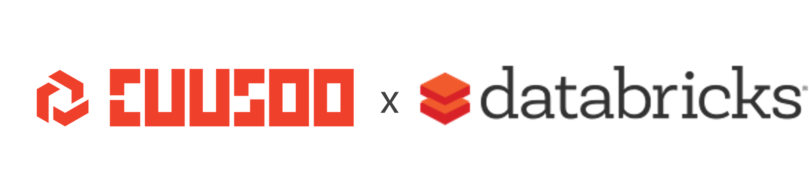

# Welcome to the Databricks Lakehouse Workshop

This workshop has been prepared in collaboration between [Cuusoo](https://www.cuusoo.com.au/) and [Databricks](https://databricks.com/). 

The workshop aims to provide participants with:

- A deep understanding of the delta lake file format in relation to the data lakehouse architecture.  
- Ability to ingest and transform data using the medallion methodology (bronze, silver, gold).

:video_camera: Recording: https://www.youtube.com/watch?v=mrHfdeH6az0

# Content structure

Within each topic folder, there will be sub-folders for:

- `unsolved`: contains the unsolved starter code. Students should refer to the Python comments for instructions for the activity.
- `solved` : contains the solved solutions. 

# Getting started 

Clone this git repository into your Databricks Repos by following the steps below (taken from [link](https://docs.databricks.com/repos.html#clone-a-remote-git-repository)):

1. Click Repos Icon Repos in the sidebar.
2. Click Add Repo.
3. In the Add Repo dialog, click Clone remote Git repo and enter the repository URL. Select your Git provider from the drop-down menu, optionally change the name to use for the Databricks repo, and click Create. The contents of the remote repository are cloned to the Databricks repo.
